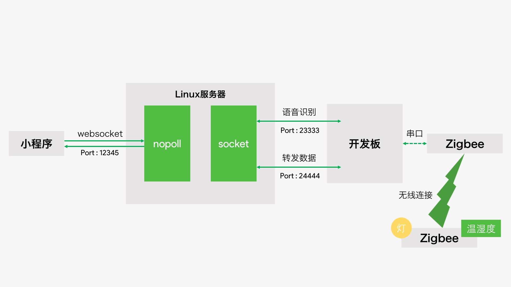
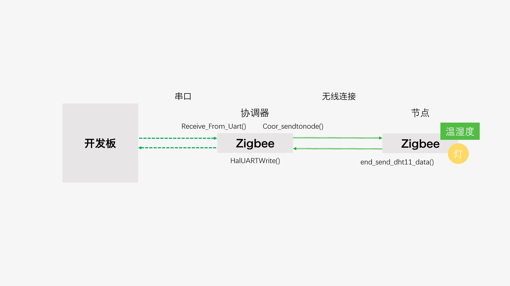
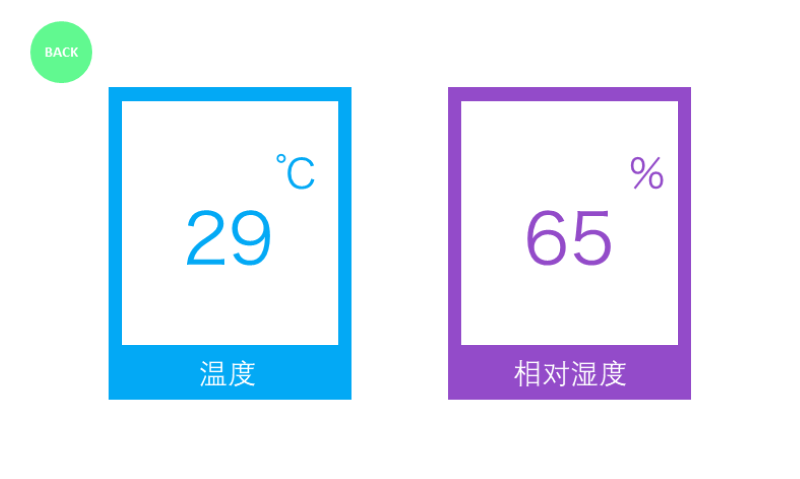
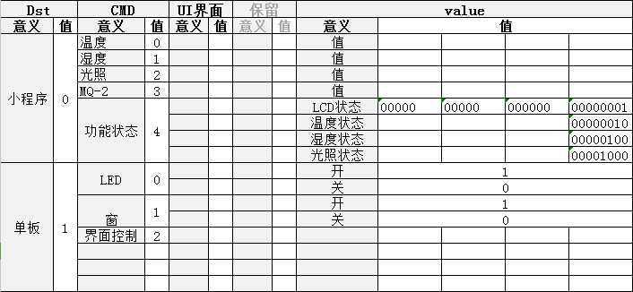
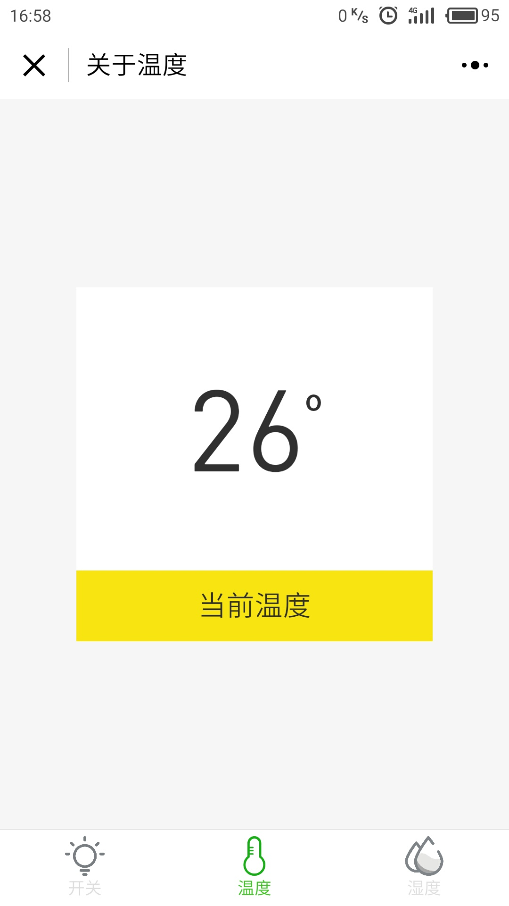

### 智能管家系统项目文档
---------
**开发人员**

* 高权奥
* 林展翔

**文档日期:2017年8月29日**

------

[toc]

### 1. 概述

#### 1.1 项目概述

智能管家系统由ARM开发板，Linux服务器，Zigbee模块，微信小程序四部分组成，可以实现在微信小程序上远程操控zigbee模块上的LED灯，查看Zigbee模块上发的温湿度信息(每五秒更新一次)，ARM开发板可以播放音乐，相册浏览，语音控制LED的亮灭和查看温湿度信息。Linux服务器充当小程序和ARM开发板之间通信的跳板，同时运行着讯飞语音识别服务，收到ARM开发板上发来的语音文件，进行识别之后以XML格式返回识别结果。
  
<center>项目总体架构</center>



<center>Zigbee与开发板通信流程</center>



### 2. 运行环境配置与编译过程

#### 2.1 环境配置

为主机，linux服务器， ARM开发板绑定IP地址

主机IP：192.168.200.126 使用**IPOP v4.1**软件绑定IP地址
Linux服务器IP: 192.168.200.125 虚拟机的网络设置为**桥接模式**
ARM开发板IP: 192.168.200.124 ```ifconfig eth0 192.168.200.124```

#### 2.2 ARM开发板配置

##### 2.2.1 alsa配置，用于录音
```language
cd /dev && mkdir snd
cd /snd
运行如下命令
mknod dsp c 14 3
mknod audio c 14 4
mknod mixer c 14 0
mknod controlC0 c 116 0
mknod seq c 116 1
mknod pcmC0D0c c 116 24
mknod pcmC0D0p c 116 16
mknod pcmC0D1c c 116 25
mknod pcmC0D1p c 116 17
mknod timer c 116 33
```
##### 2.2.2 madplay配置，用于播放mp3

将已经交叉编译好的madplay拷贝到开发板的```/usr/bin```目录下，运行```madplay --help```查看是否配置成功。

##### 2.2.3 tslib配置，用于触摸屏操作
##### 2.2.4 libpng配置, 用于显示PNG图片
```进入第三方库/png文件夹, 按照文档配置libpng```
##### 2.2.5 libjpeg配置，用于显示JPEG图片
```进入第三方库/jpeg移植文件夹, 按照文档配置libjpeg```
##### 2.2.6 ffmpeg配置，用于图片resize，blur等操作
```进入第三方库/ffmpeg文件夹, 按照文档配置ffmpeg```

#### 2.3 linux服务器配置

##### 2.3.1 编译安装nopoll 用于与小程序通过websocket通信
##### 2.3.2 编译安装libxml 用于解析科大讯飞语音识别结果(XML文件)

#### 2.4 编译与运行
##### 2.4.1 ARM开发板代码编译与运行
```bash
cd /ARM_code/src && make
```
通过串口将/ARM_code/bin目录下的main发送到ARM到开发板上

```bash
chmod 777 main
./main
```
##### 2.4.2 linux服务器代码编译与运行
```bash
cd Linux_code\samples\asr_sample
./32bit_make.sh
```

```bash
cd Linux_code\bin
./asr_sample
```

### 3. 开发板端代码设计

<center>主界面</center>


#### 3.1 音乐部分

##### 3.1.1 音乐部分代码概述

> 代码详见
> /src/music.c
> /include/music.h

- 使用双向循环链表，用于歌曲之间的切换
- 使用ffmpeg提取mp3文件的专辑封面，更改jpg文件分辨率和模糊操作
- 操作按钮为png素材(交叉编译libpng)

**可实现切歌的同时切换专辑封面和背景**

<center>音乐界面</center>


##### 3.1.2 双向循环链表代码实现

<center>链表节点设计</center>

```cpp
typedef struct music_node
{
	char filepath[256];	 //mp3文件路径
	char blur_picpath[256];  //模糊图片路径
	char little_picpath[256];//小图片路径
	struct music_node *prev;
	struct music_node *next;
}music_listnode, *music_list;

```
<center>实现双向循环链表</center>

```cpp
music_list music_init_list(void)
{
	music_list head = malloc(sizeof(music_listnode));
	if( head == NULL )
	{
		perror("malloc node fail\n");
		exit(1);
	}
	head->prev = head->next = head;
	return head;
}

music_list insert_music_node(music_list new, music_list p)
{
	if( (new == NULL) || (p == NULL) )
	{
		perror("tring to insert null node into list!\n");
		exit(1);
	}
	new->next = p;
	new->prev = p->prev;
	p->prev->next = new;
	p->prev = new;
}
```

<center>读取当前目录下所有的mp3文件并生成双向循环链表</center>

```cpp
music_list find_music()
{
	int mp3_num = 0;

	DIR *dir = NULL;
	struct dirent *tmp;
	music_list new = NULL;
	music_list head = music_init_list(); //头结点

	char tmp_path[256] = {0};
	char tmp_blurpicpath[256] = {0};//模糊图片路径
	char tmp_littlepicpath[256] = {0};//小图片路径

	dir = opendir("./music");
	if(NULL == dir)
	{
		perror("opendir fail!\n");
		exit(1);
	}

	while((tmp = readdir(dir)) != NULL)
	{
		if( (tmp->d_type == 8) && ( strstr(tmp->d_name, ".mp3") != NULL ) )
		{
			char *filename;
			filename = tmp->d_name;
			sprintf(tmp_path,"./music/%s", filename);
			char *last_dot = strrchr(filename, '.');
			*last_dot = '\0'; //修改.为‘\0’以获取文件名前缀
			sprintf(tmp_littlepicpath, "./music/%s_240.jpg", filename);
			sprintf(tmp_blurpicpath, "./music/%s_bg.jpg", filename);

			if(mp3_num == 0) //链表头
			{
				stpcpy(head->filepath, tmp_path);
				stpcpy(head->little_picpath, tmp_littlepicpath);
				stpcpy(head->blur_picpath, tmp_blurpicpath);
				printf("%s %s %s\n",head->filepath, head->little_picpath, head->blur_picpath);
			}
			else
			{
				new = music_init_list(); //插入新节点到链表中
				stpcpy(new->filepath, tmp_path);
				stpcpy(new->little_picpath, tmp_littlepicpath);
				stpcpy(new->blur_picpath, tmp_blurpicpath);
				printf("%s %s %s\n",new->filepath, new->little_picpath, new->blur_picpath);
				insert_music_node(new, head);
			}
			mp3_num++;
		}
	}
	return head;
}
```

##### 3.1.3 歌曲切换代码实现

以切换到下一首歌为例

```cpp
if((ts_x >= 484) && (ts_x <= 530) && (ts_y >= 365) && (ts_y <= 411))
{
    system("killall -KILL madplay &");
    p = p->next;    //下一首
    showjpg(p->blur_picpath);//模糊背景切换
    lcd_draw_jpg(280, 87, p->little_picpath, jpegbuf, jpeglength, 0); //专辑封面
    fb_draw_image_png(&fb, 271, 363, "./res/white_prev.png");
    fb_draw_image_png(&fb, 484, 363, "./res/white_last.png");
    fb_draw_image_png(&fb, 378, 363, "./res/white_play.png"); //播放控制按钮
    fb_draw_image_png(&fb, 28, 20,"./res/back_65_65.png"); //返回按钮
    sprintf(tmp_path,"madplay \"%s\" & ",p->filepath);

    system(tmp_path);
    ts_x = 0; ts_y = 0;
    state_flag = 1;
}
```

##### 3.1.4 模糊化背景实现

用bash脚本从MP3文件中提取专辑封面并生成模糊背景

```bash
filename="$1"
prefix="${filename%.*}"
suffix="${filename##*.}"
jpgfile=${prefix}".jpg"
jpgfile_240=${prefix}"_240.jpg"
jpgscale=${prefix}"_scale.jpg"
jpg_test_bg=${prefix}"_test_bg.jpg"
jpg_bg=${prefix}"_bg.jpg"

ffmpeg -i "${filename}"  "${jpgfile}"
ffmpeg -i  "${jpgfile}" -vf scale=240:240 "${jpgfile_240}"
ffmpeg -i  "${jpgfile}" -vf scale=800:480 "${jpgscale}"
ffmpeg -i "${jpgscale}" -vf boxblur=59:1 "${jpg_test_bg}"
ffmpeg -i "${jpg_test_bg}" -vf boxblur=59:1 "${jpg_bg}"

rm "${jpgfile}"
rm "${jpgscale}"
rm "${jpg_test_bg}"
```

**用法**

```bash
# 将上述脚本保存为gen_bg.sh
./gen_bg.sh "mp3文件名"
```

<center>上述bash脚本生成的模糊化背景实例</center>


#### 3.2 相册部分

##### 3.2.1 相册代码概述

> 代码详见
> /src/album.c
> /include/album.h

- 双向循环链表，用于图片的切换
- 支持显示bmp，png，jpg

> 相册操作逻辑
> - 默认显示开发板```picture```目录下的第一张图片
> - 点击屏幕显示**相册控制界面**, 若点击非控制界面区域，即退出控制界面
> - 点击控制界面中的**自动播放**后，进入自动播放模式，每一秒切换一次
> - 在**自动播放**模式中，点击屏幕即可退出**自动播放**模式

##### 3.2.2 双向循环链表代码实现

与音乐的双向循环链表实现相似，这里只给出链表节点的代码

```cpp
typedef struct node
{
	char path[256]; //用于存储图片在开发板中的路径
	struct node *prev;
	struct node *next;
}listnode, *my_list;
```

##### 3.2.3 相册控制界面代码实现

```cpp
//循环播放
else if ( (ts_y >410) && (ts_x < 533) && (ts_x > 266))
{
    printf("into auto play mode\n");
    ts_x = 0;
    ts_y = 0;

    my_ts_close(); //将之前的触摸屏文件关闭

	//arg为包含有x轴坐标,y轴坐标, 压力值的结构体
    //用于为get_ts线程的参数传递
    struct parameter arg;
    arg.pos_x = 0;
    arg.pos_y = 0;
    arg.press = 0;

    //创建返回触摸屏坐标的线程
    pthread_t thread_xy;
    pthread_create(&thread_xy, NULL, get_ts, &(arg));

    while(1)
    {
        //退出自动播放模式
        if((arg.pos_x != 0) && (arg.pos_y != 0))
        {
            control_flag = 0;
            printf("break out auto play\n");
            pthread_cancel(thread_xy); //取消掉get_ts线程
            my_ts_open(); //重新打开触摸屏文件
            break;
        }
        else
        {
            if(strstr(p->path, ".bmp") != NULL)	{
                //如果是bmp图片
                show_bmp(p->path);
            }
            else{
            	//如果是jpg
                showjpg(p->path);
            }
            sleep(1);
            p = p->next; //指针指向下一张图片
        }

    }
}
```

<center>控制界面设计</center>


##### 3.2.4 用于开发板显示jpg, png的代码实现

在LCD上显示jpg图片

```cpp
int lcd_draw_jpg(unsigned int x, unsigned int y, const char *pjpg_path, char *pjpg_buf, unsigned int jpg_buf_size, unsigned int jpg_half)

参数说明 :
1. unsigned int x : 显示jpg图片的x轴起点
2. unsigned int y : 显示jpg图片的y轴起点
3. const char *pjpg_path : jpg图片的路径
4. char *pjpg_buf : 用于显示jpg图片的缓冲区
5. unsigned int jpg_buf_size : 缓冲区大小
6. unsigned int jpg_half : 置为1则jpg以原来1/4的大小显示，置为0正常显示
```

在LCD上显示800*480像素的jpg图片

```cpp
void showjpg(char *jpgpath) //直接指定jpg图片所在的路径即可

参数说明 :
char *jpgpath : 800*480像素大小的jpg图片的路径
```

在LCD上显示png图片

```cpp
fb_t fb; //定义用于解析png格式的结构体

//用于png显示的初始化代码
if (!fb_initialize(&fb, "/dev/fb0"))
{
    fatal("Can't initialize display - %s", fb.result_string);
}

bool fb_draw_image_png(fb_t *fb, ssize_t pos_x, ssize_t pos_y, const char *path)

参数说明 :
1. fb_t *fb : 用于解析png图片格式的结构体
2. ssize_t pos_x ： 显示png图片的x轴起点
3. ssize_t pos_y :  显示png图片的y轴起点
4. const char *path : 用于显示的png图片的路径
```

#### 3.3 录音部分

##### 3.3.1 录音代码概述

> 代码详见
> /src/rec.c
> /include/rec.h

- 创建用于录音过程中切换图片的线程，以让用户觉得正在进行录音
- 如果连接linux服务器失败，将会推出录音界面，回到主界面
- 连接linux服务器成功的话，将会将录音文件发送给服务器，显示录音成功界面

##### 3.3.2 录音功能代码实现

```cpp
int proc_rec()
{
	printf("we are in rec\n");

	//创建循环播放录音界面的线程
	pthread_t pthread_rec;
	pthread_create(&pthread_rec,NULL,(void *)showjpg_rec,NULL);

    //录音
	system("arecord -d3 -c1 -r16000 -twav -fS16_LE example.wav");

	//socket连接并发送文件
    //运行socket可执行文件接收  本机IP192.168.200.125
	if (-1 == socket_init()) //尝试连接服务器
	{
		printf("we will go back to main\n");
		g_state = G_MAIN;
		ts_x = 0;
		ts_y = 0;
		pthread_cancel(pthread_rec);
		return 0;
	}

	send_voice_file("example.wav"); //发送录好的音频给服务器

	pthread_cancel(pthread_rec);
	showjpg("./res/voice_success.jpg"); //显示录音成功界面

	close_voice_socket(); //关闭与服务器的连接

	while(1)
	{
		get_x_y(&ts_x, &ts_y);
		if((ts_x >= 29) && (ts_x <= 92) && (ts_y >= 19) && (ts_y <= 81))
		{
			g_state = G_MAIN;
			ts_x = 0;
			ts_y = 0;
			break;
		}
	}
}
```
##### 3.3.3 录音界面

<center>正在录音</center>


<center>录音成功界面</center>


#### 3.4 温湿度部分

##### 3.4.1 温湿度代码概述

> 接收由Zigbee上发的温湿度数据，显示在开发板上，每五秒更新一次
> 创建了一个用于更新界面的线程，退出温湿度界面时取消掉该线程

##### 3.4.2 温湿度代码实现

```cpp
void *update_temp_humid(void *arg)
{
	char filepath[256] = {0};

	while(1)
	{
    	//温度的高位数字
		sprintf(filepath, "./res/%d.jpg",T_high);
		lcd_draw_jpg(145, 190, filepath, jpegbuf, jpeglength, 0);
		bzero(filepath, sizeof(filepath));

        //温度的低位数字
		sprintf(filepath, "./res/%d.jpg",T_last);
		lcd_draw_jpg(230, 190, filepath, jpegbuf, jpeglength, 0);
		bzero(filepath, sizeof(filepath));

        //湿度度的高位数字
		sprintf(filepath, "./res/purple_%d.jpg",H_high);
		lcd_draw_jpg(485, 190, filepath, jpegbuf, jpeglength, 0);
		bzero(filepath, sizeof(filepath));

        //湿度度的低位数字
		sprintf(filepath, "./res/purple_%d.jpg",H_last);
		lcd_draw_jpg(570, 190, filepath, jpegbuf, jpeglength, 0);
		bzero(filepath, sizeof(filepath));

		sleep(5);
	}

}

int proc_temp()
{
	showjpg("./res/temp.jpg"); //显示背景图

	//创建用于更新界面的线程
	pthread_t update;
	pthread_create(&update, NULL, update_temp_humid, NULL);

	while(1)
	{
		get_x_y(&ts_x, &ts_y); //获取触摸屏返回的x,y坐标
		if((ts_x >= 29) && (ts_x <= 92) && (ts_y >= 19) && (ts_y <= 81))
		{
			printf("break out temp\n");
			g_state = G_MAIN;
			pthread_cancel(update); //取消用于更新界面的线程
			ts_x = 0;
			ts_y = 0;
			break;
		}
	}

}
```

##### 3.4.3 温湿度界面



#### 3.5 与串口通信

##### 3.5.1 串口相关代码概述

> 代码详见
> /src/serial.c
> /include/serial.h

- 先设置好串口的属性例如波特率，奇偶校验位等
- 打开串口文件，用write将数据写入串口，用read从串口中读出数据


##### 3.5.2 串口相关代码实现

```cpp
int init_send_serial()
{
	//1. 打开串口设备
	int serial_fd = open("/dev/s3c2410_serial3",O_RDWR);

	if(serial_fd == -1){
		printf("main:open serial error!\n");
		return -1;
	}

	//2.设置串口
	//获取串口属性
	struct termios termios_current;//为了在原来的基础上改变串口的设置（属性）

	tcgetattr(serial_fd, &termios_old);
	tcgetattr(serial_fd, &termios_current);

	//设置位raw模式
	cfmakeraw(&termios_current);
	//设置波特率
	cfsetspeed(&termios_current,B115200);

	//设置bit位 8位
	termios_current.c_cflag &= ~CSIZE;//11 0000
	termios_current.c_cflag |= CS8; //11 0000

	//设置停止位
	termios_current.c_cflag &= ~CSTOPB;//

	//关闭奇偶校验
	termios_current.c_cflag &= ~PARENB;

	termios_current.c_cflag &= ~CRTSCTS;

	tcflush(serial_fd,TCIOFLUSH);

	termios_current.c_cc[VTIME] = 0;
   	termios_current.c_cc[VMIN] = 1;

    tcsetattr(serial_fd,TCSANOW,&termios_current);

	return serial_fd;
}

void *read_from_serial()
{
	while(1)
	{
    	//从串口中读出温湿度数据
        //温湿度数据示例:T26H45
		read(serial_fd, serial_recv_buf, 6);

        //解析数据的每一位
		T_high = serial_recv_buf[1] - '0';
		H_high = serial_recv_buf[4] - '0';
		T_last = serial_recv_buf[2] - '0';
		H_last = serial_recv_buf[5] - '0';

		temp = T_high*10 + T_last;
		humid = H_high*10 +  H_last;
		// printf("%d %d %d %d %d %d\n",T_high, T_last, H_high, H_last, temp, humid);
	}
}

// 开灯函数
// 调用该函数将向串口发送11
int open_light(int serial_fd)
{
    char buf[3] = "11";
    printf("[pthread_wx]: open light\n");
    if(write(serial_fd, buf, 3) == -1)
    {
        printf("write to serial failed!\n");
    }

    printf("[open light] serial_fd: %d, buf:%s\n", serial_fd, buf );
}

// 关灯函数
// 调用该函数将向串口发送00
int close_light(int serial_fd)
{
    char buf[3] =  "00";
    printf("[pthread_wx]: close light\n");
    if(write(serial_fd, buf, 3) == -1)
    {
        printf("write to serial failed!\n");
    }
    printf("[close light] serial_fd: %d, buf:%s\n", serial_fd, buf );
}
```

#### 3.6 与微信小程序通信

##### 3.6.1 与微信小程序通信相关代码概述

<center>通信协议设计</center>



  与小程序的通信其实是通过协议实现的，要向小程序发送温湿度数据，只需将通信协议的Dst设置为0，cmd设置为对应的值，在value中填充数据即可。同理，接收到小程序发来的数据只需将cmd和value中的值取出来，就可以知道具体的指令是什么了。需要注意的是网络字节序与主机字节序的转换。

##### 3.6.2 向小程序发送数据

```cpp
void * send2weixin(void * arg)
{
	protocol * pro = create_pro();
	protocol * temp_pro = create_pro();

	while(1)
	{
		putData(pro, WX_APP, WX_APP_H, 0, 0, humid);
		putData(temp_pro, WX_APP, WX_APP_T, 0, 0, temp);
		printf("[send2weixin]:humid %d\n", humid);
		printf("[send2weixin]:temp %d\n", temp);
		//发送湿度数据 5s
		if ( (-1 == send_msg_weixin(pro, 8)) || (1 == send_msg_weixin(temp_pro, 8)) )
		{
			printf("we will quit send to weixin thread\n");
			break;
		}
		sleep(5);
	}
}
```


##### 3.6.3 接受小程序发来的数据

```cpp
void *pthread_wx(void * arg)
{
	printf("[ARM] : pthread_wx started!\n");
	char msg_buff[8] = {0};
	int msg_num = 0;
	while(1)
	{
		msg_num = recv_data(msg_buff, 8);
		if (-1 == msg_num)
		{
			break;
		}
		protocol * msg_buff_p = (protocol *)msg_buff;
		net2host(msg_buff_p); //网络字节序转主机字节序

		// 进行位操作, 获取命令
		if(msg_num != 0)
		{
			switch(msg_buff_p->command.command.cmd)
			{
				case 0:
					//LED
					if(msg_buff_p->value > 0){
						open_light(serial_fd); //开灯
					}
					else{
						close_light(serial_fd); //关灯
					}
					continue;
				case 1:
					continue;
				case 2:
					continue;
			}
			return 0;
		}
	}
}
```


### 4. 服务器端代码设计

#### 4.1 Linux服务器功能概述

Linux系统作为服务器端，是ARM开发板和微信小程序的通信转发节点。Linux服务器与**ARM开发板**用的是**socket**连接，**Linux**服务器与**微信小程序**采用的是**websocket**连接。通过上述连接以最终实现通过ARM开发板采集温湿度数据，能够将其传输到微信小程序。微信小程序也可以发送回一些简单的指令来控制ARM开发板上的硬件设施。例如，对于ZigBee板上的LED灯进行开关。

**Linux服务器功能**

- 接收ARM开发板传回的语音数据，通过**讯飞离线语音库**将其解析成XML文件。
- 通过**libxml2**对于XML文件进行解析，并将解析结果发回到ARM开发板。
- 接收ARM开发板的环境数据，将其转发给微信小程序。
- 接受微信小程序发送的命令消息，将其转发到ARM开发板之上。

#### 4.2 建立ARM开发板与服务器的Socket连接

<center>项目总体架构</center>


如上图所示，Linux服务器的23333端口用来处理录音文件的接收，而24444端口用来转发数据(双向)

##### 4.2.1 voice socket 的建立
代码详见Linux_code\samples\asr_sample\socket.c

```cpp
int voice_socket_init() //在23333端口建立socket
int voice_wait_connect() //等待ARM开发板连接上来(accept)
int recv_file(char * file_path) //接收ARM开发板上传的example.wav语音文件
int close_voice() //关闭voice socket
```

需要注意的一点是，并在bind函数之前需要设置socket的端口重用，不然客户端重连的时候会出现服务器端bind端口失败的问题

```cpp
int on = 1;
int ret = setsockopt( socked_fd, SOL_SOCKET, SO_REUSEADDR, &on, sizeof(on));
```

##### 4.2.2 data socket 的建立
```cpp
int data_socket_init() //在24444端口建立socket
int data_wait_connect() //等待ARM开发板连接上来

//转发ARM开发板发来的数据给微信小程序
int recv_data(protocol * msg_buff, unsigned int msg_len) 

//Linux服务器解析完语音识别结果之后，填充开关灯指令进入通信协议，发送给开发板处理
int send_voice_data(protocol * msg_buff, unsigned int msg_len)

//转发微信小程序发来的数据给ARM开发板
int send_data(char * data, unsigned int len)
int close_data() //关闭data socket
```

值得一提的是，voice data在收完ARM开发板发来的的example.wav之后就会被关闭，而data socket会不停的转发ARM开发板发来的温湿度数据给微信小程序，相关代码如下所示:


```cpp
void *pthread_socket_data(void *arg)
{
	char msg_buff[8] = {0};
	while(1)
	{
		int ret = 0;

    	//收到arm上发来的信息转发到微信端
		ret = recv_data((protocol *)msg_buff, 8);
		printf("[socket_data]:%s\n", msg_buff);

		if( -1 != ret )
		{
			host2net((protocol *)msg_buff);//将数据转化为网络字节序
			websocket_send((protocol *)msg_buff, 8);
			memset((protocol *)msg_buff, 0, sizeof(msg_buff));
		}
		else
		{
			printf("[socket_data]:arm disconnet\n");
			close_data();
		}
		sleep(1);
	}
}
```

#### 4.3 websocket连接建立

代码详见Linux_code\samples\asr_sample\websocket.c

```cpp
//初始化websocket
int init_websocket_v12()

//监听小程序发来的数据，如果是8个字节就调用data socket中的send_data转发给ARM开发板
void listener_on_message (noPollCtx * ctx, noPollConn * conn, noPollMsg * msg, noPollPtr  user_data)

//通过与小程序建立的websocket连接发送数据给微信小程序
int websocket_send(void * msg,unsigned int len)

```

#### 4.4 讯飞离线语音库

我们根据讯飞语音识别的文档重写了bnf文件，也就是语音识别逻辑，使之后xml文件的解析变得更加容易，同时也增强了语音命令的灵活性。

> 例如: 开灯指令可以说成
- 开灯
- 开一下灯
- 打开日光灯
- 把灯打开
- 等等....

<center>call.bnf</center>

```js
#BNF+IAT 1.0 UTF-8;
!grammar call;
!slot <hold>;
!slot <light>;
!slot <window>;
!slot <open>;
!slot <close>;
!start <commands>;  //定义主规则
<commands>:<controlLight>|<controlWindow>;
<controlLight>:<open><light>|[<hold>]<light><open>|<close><light>|[<hold>]<light><close>;
<controlWindow>:<open><window>|[<hold>]<window><open>|<close><window>|[<hold>]<window><close>;
<hold>:把;
<open>:开|开一下|打开;
<close>:关|关一下|关闭|关掉;
<light>:灯|灯光|日光灯;
<window>:窗|窗户;

```

#### 4.5 XML文件解析

我们可以看到科大讯飞语音识别返回XML文件的内容如下所示，得益于我们对bnf文件的改造，我们将xml标签与命令，物件关联了起来close对应于关，open对应于开，light对应于灯，window对应于窗，这为我们接下来xml的解析提供便利，只要能在xml文件中找到对应的标签就能知道对应的命令或者物件。

<center>test.xml文件的内容</center>

```xml
<?xml version='1.0' encoding='utf-8' standalone='yes' ?><nlp>
  <version>1.1</version>
  <rawtext>关灯</rawtext>
  <confidence>82</confidence>
  <engine>local</engine>
  <result>
    <focus>close|light</focus>
    <confidence>98|75</confidence>
    <object>
      <close id="65535">关</close>
      <light id="65535">灯</light>
    </object>
  </result>
</nlp>
```


使用libxml解析xml文件

```cpp

int object = -1;
int status = -1;

//遍历xml的Dom树
static void print_element_names(xmlNode * a_node)
{
    xmlNode *cur_node = NULL;

    for (cur_node = a_node; cur_node; cur_node = cur_node->next)
    {
        if (cur_node->type == XML_ELEMENT_NODE) 
        {
			// 标签中含有<open>
            if(!strcmp(cur_node->name, "open")){
                printf("[xml_read] on!\n");
                status = ON;
            }

			// 标签中含有<close>
            if(!strcmp(cur_node->name, "close")){
                printf("[xml_read] off!\n");
                status = OFF;
            }

			// 标签中含有<light>
            if(!strcmp(cur_node->name, "light")){
                printf("[xml_read] led!\n");
                object = BOARD_LED;
            }

			// 标签中含有<window>
            if(!strcmp(cur_node->name, "window")){
                printf("[xml_read] window!\n");
                object = BOARD_WIN;
            }
            // printf("node type: Element, name: %s\n", cur_node->name);
        }
		//递归调用，遍历当前标签的子标签
        print_element_names(cur_node->children);
    }
}

int xml_read(char * filename,  protocol * pro)
{
    xmlDoc *doc = NULL;
    xmlNode *root_element = NULL;

    /*parse the file and get the DOM */
    doc = xmlReadFile(filename, NULL, 0);

    if (doc == NULL) {
        printf("error: could not parse file %s\n", filename);
    }

    /*Get the root element node */
    root_element = xmlDocGetRootElement(doc);

    print_element_names(root_element);

    /*free the document */
    xmlFreeDoc(doc);

    xmlCleanupParser();
    printf("object:%d, status:%d\n", object, status);
    //将解析结果填入协议结构体pro中
    putData(pro, BOARD, object, 0, 0, status);
    return 0;
}

```

值得注意的是在安装好了libxml后，需要在Makefile中包含libxml的头文件并链接libxml

```Makefile
CFLAGS = -g -Wall -I$(DIR_INC) -I/usr/local/include/nopoll -I/usr/local/include/libxml2/

ifdef LINUX64
LDFLAGS := -L$(DIR_LIB)/x64 -L/usr/local/lib
else
LDFLAGS := -L$(DIR_LIB)/x86 -L/usr/local/lib
endif
LDFLAGS += -lmsc -lrt -ldl -lpthread -lnopoll -lxml2
```

### 5. 小程序代码设计

#### 5.1 小程序界面


|  |  |
| ---------------------------------------- | ---------------------------------------- |
|  |  


#### 5.2 底部tab栏实现

```js
"tabBar" : {
"color": "#dddddd",
"selectedColor": "#3cc51f",
"borderStyle": "black",
"backgroundColor": "#ffffff",
"list" : [
    {
      "pagePath" : "pages/index/index",
      "iconPath" : "image/light.png",
      "selectedIconPath": "image/lightHL.png",
      "text" : "开关"
    },
    {
      "pagePath": "pages/temperature/temperature",
      "iconPath": "image/temp.png",
      "selectedIconPath": "image/tempHL.png",
      "text": "温度"
    },
    {
      "pagePath": "pages/humid/humid",
      "iconPath": "image/humid.png",
      "selectedIconPath": "image/humidHL.png",
      "text": "湿度"
    }
  ]
}
```

#### 5.3 开关灯界面实现

##### 5.3.1 wxml代码

```xml
<view class="container">

  <view class="light_wrap">
    <!--为image绑定图片地址src-->
    <image id="light"  src="{{src}}"></image>
  </view>

  <view class="button_wrap">
    <!--为view绑定点击事件-->
    <view id="button_text"  bindtap="ledCtrollSwitch">灯光开关</view>
  </view>

</view>
```

##### 5.3.2 js代码

```js
Page({
  data: {
     isOpenLed : false,//LED灯控制
     isOpenWindow : false, //窗控制
     isOpenUi : false, //UI界面控制
     toArm : 1, //发送给Arm
     src: "../../image/light_close.png"
  },

  //点击事件回调函数
  ledCtrollSwitch : function () {
    var that = this;
    //初始为关灯状态
    var temp =  "../../image/light_close.png";

    if (this.data.isOpenLed)
    {
      temp = "../../image/light_close.png";
    }
    else
    {
      temp = "../../image/light_open.png";
    }

    //调用this.setData更新LED状态和src所指向的图片
    this.setData({
      isOpenLed: !that.data.isOpenLed,
      src: temp
    })
  }
```


##### 5.3.3 css代码实现
```css
.container {
  width: 100%;
  height: 100%;
  display: flex;
  flex-direction: column;
  align-items: center;
  justify-content: center;
  background: #f6f6f6;
  position: fixed;
}

.light_wrap {
  display: flex;
  flex-direction: column;
  align-items: center;
  justify-content: center;
  height: 200px;
  width: 70%;
  background-color: #ffffff; 
}

.light_wrap #light{
  display: flex;
  width: 100px;
  height: 138px;
}
.button_wrap {
  display: flex;
  flex-direction: column;
  height: 50px;
  width: 70%;
  background-color: #459ae9;
}

.button_wrap #button_text {
  display: flex;
  align-items: center;
  justify-content: center;
  height: 100px;
  font-size: 20px;
  color: #ffffff;
}
```

